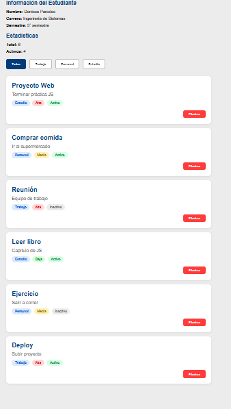
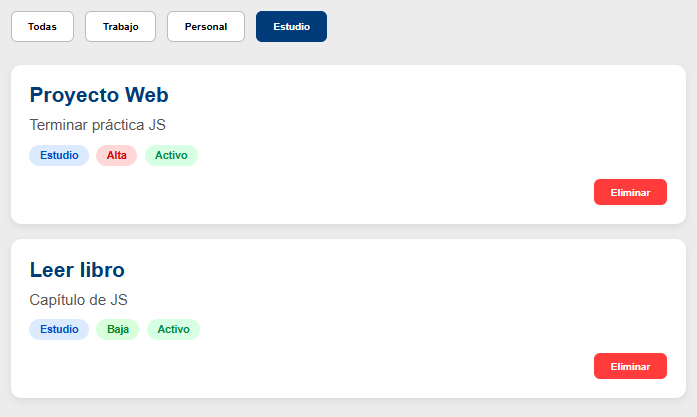

# Práctica 2 - Manipulación del DOM


# Descripción breve de la solución

En esta práctica se desarrolló una aplicación web utilizando **HTML, CSS y JavaScript**, aplicando conceptos de **manipulación del DOM**.

La aplicación muestra información del estudiante, estadísticas de elementos registrados y una lista dinámica de tarjetas con tareas o actividades.

También se implementó un sistema de filtros por categoría para mostrar únicamente los elementos seleccionados.

Se utilizaron funciones JavaScript para:

* Seleccionar elementos del DOM
* Crear elementos dinámicamente
* Insertar contenido con `textContent`
* Eliminar elementos
* Filtrar datos con `.filter()`
* Actualizar estadísticas automáticamente


# Tecnologías utilizadas

* HTML5
* CSS3
* JavaScript Vanilla


# Estructura del proyecto

```bash id="vrxg6l"
/02-dom-basico
│── index.html
│── css/
│   └── styles.css
│── js/
│   └── app.js
│── assets/
│   ├── 01-vista-general.png
│   ├── 02-filtrado.png
│ 
│── README.md
```


# Código relevante

## 1. Renderizado de la lista

La función recorre el arreglo de datos y crea tarjetas dinámicamente usando `createElement()`.

```javascript id="0w4p06"
function renderizarLista(datos) {
  const contenedor =
    document.getElementById('contenedor-lista');

  contenedor.innerHTML = '';

  datos.forEach(el => {
    const card = document.createElement('div');
    card.classList.add('card');

    const titulo = document.createElement('h3');
    titulo.textContent = el.titulo;

    const descripcion = document.createElement('p');
    descripcion.textContent = el.descripcion;

    card.appendChild(titulo);
    card.appendChild(descripcion);

    contenedor.appendChild(card);
  });
}
```


## 2. Eliminación de elementos

Permite borrar una tarjeta de la lista mediante su `id`.

```javascript id="4vwf4w"
function eliminarElemento(id) {
  const index = elementos.findIndex(
    elemento => elemento.id === id
  );

  if (index !== -1) {
    elementos.splice(index, 1);
    renderizarLista(elementos);
  }
}
```


## 3. Filtrado por categoría

Muestra solamente los elementos pertenecientes a la categoría seleccionada.

```javascript id="fkr5o4"
function inicializarFiltros() {

  const botones =
    document.querySelectorAll('.btn-filtro');

  botones.forEach(btn => {

    btn.addEventListener('click', () => {

      const categoria =
        btn.dataset.categoria;

      if (categoria === 'todas') {
        renderizarLista(elementos);
      } else {

        const filtrados =
          elementos.filter(
            el => el.categoria === categoria
          );

        renderizarLista(filtrados);
      }

    });

  });

}
```


# Imágenes del proyecto

## Vista general de la aplicación




## Filtro aplicado





# Funcionalidades implementadas

✔ Mostrar información del estudiante
✔ Mostrar estadísticas dinámicas
✔ Renderizar tarjetas con JavaScript
✔ Filtrar por categorías
✔ Diseño responsive
✔ Uso de createElement()
✔ Uso de textContent()


# Conclusión

En esta práctica reforcé el uso del **DOM en JavaScript**, aprendiendo a crear y modificar elementos HTML desde código.

También comprendí cómo trabajar con arreglos y eventos para actualizar la interfaz dinámicamente.

Fue una práctica importante para entender cómo funcionan las aplicaciones web modernas sin frameworks.+

## Datos del estudiante

**Nombre:** Denisse Paredes
**Correo:** dparedesp5@est.ups.edu.ec
