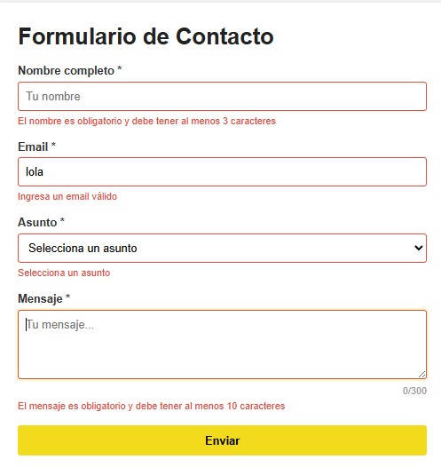
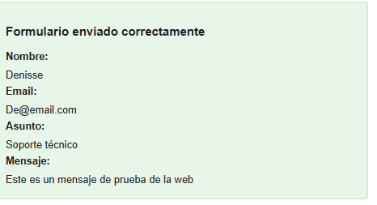
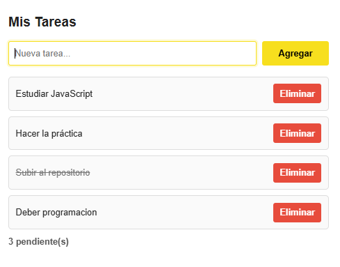
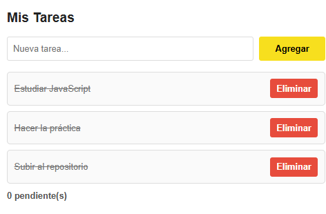

# Práctica 3 - Eventos en JavaScript


---

## Descripción de la solución implementada

En esta práctica se desarrolló una aplicación web usando **HTML, CSS y JavaScript**, enfocada en el manejo de eventos del DOM.

El proyecto contiene dos módulos principales:

### Formulario de contacto

Permite ingresar:

* Nombre completo
* Correo electrónico
* Asunto
* Mensaje

El formulario valida los datos antes del envío y muestra un mensaje exitoso con la información ingresada.

### Lista de tareas

Permite:

* Agregar tareas nuevas
* Marcar tareas completadas
* Eliminar tareas
* Mostrar tareas pendientes

Se aplicó **event delegation** para manejar eventos de forma eficiente.

---

## Tecnologías utilizadas

* HTML5
* CSS3
* JavaScript Vanilla

---

## Estructura del proyecto

# Práctica 3 - Eventos en JavaScript

## Estudiante
**Nombre:** Denisse Paredes  
**Correo:** dparedesp5qest.ups.edu.ec  

---

## Estructura del proyecto

```bash
practica-3/
│── index.html
│── css/
│   └── styles.css
│── js/
│   └── app.js
│── assets/
│   ├── validacion.png
│   ├── enviado.png
│   ├── tareas.png
│   ├── contador.png
│   └── completadas.png
│── README.md


---

# Código destacado

## 1. Validación del formulario con preventDefault()

```javascript
formulario.addEventListener('submit', (e) => {
  e.preventDefault();

  const nombreValido = validarNombre();
  const emailValido = validarEmail();
  const asuntoValido = validarAsunto();
  const mensajeValido = validarMensaje();

  if (
    nombreValido &&
    emailValido &&
    asuntoValido &&
    mensajeValido
  ) {
    mostrarResultado();
    resetearFormulario();
  }
});
```

---

## 2. Delegación de eventos en la lista de tareas

```javascript
listaTareas.addEventListener('click', (e) => {
  const action = e.target.dataset.action;

  if (!action) return;

  const item = e.target.closest('li');
  const id = Number(item.dataset.id);

  if (action === 'eliminar') {
    tareas = tareas.filter(tarea => tarea.id !== id);
    renderizarTareas();
  }

  if (action === 'toggle') {
    const tarea = tareas.find(t => t.id === id);

    if (tarea) {
      tarea.completada = !tarea.completada;
    }

    renderizarTareas();
  }
});
```

---

## 3. Atajo de teclado Ctrl + Enter

```javascript
document.addEventListener('keydown', (e) => {
  if (e.ctrlKey && e.key === 'Enter') {
    e.preventDefault();
    formulario.requestSubmit();
  }
});
```

---

## 4. Agregar nueva tarea

```javascript
function agregarTarea() {
  const texto = inputNuevaTarea.value.trim();

  if (texto === '') return;

  tareas.push({
    id: Date.now(),
    texto,
    completada: false
  });

  inputNuevaTarea.value = '';
  renderizarTareas();
}
```

---

## 5. Renderizado dinámico de tareas

```javascript
function renderizarTareas() {
  listaTareas.innerHTML = '';

  tareas.forEach((tarea) => {
    const li = document.createElement('li');
    li.dataset.id = tarea.id;

    li.innerHTML = `
      <span data-action="toggle">${tarea.texto}</span>
      <button data-action="eliminar">Eliminar</button>
    `;

    listaTareas.appendChild(li);
  });
}
```

---

#  Imágenes de la práctica

## Validación


---

## Formulario enviado


---

## Lista de tareas


---

## Contador


---

## Tareas completadas

---

# Funcionalidades implementadas

✔ Validación de formulario
✔ preventDefault()
✔ Blur e input events
✔ Contador de caracteres
✔ Ctrl + Enter
✔ Lista dinámica
✔ Eliminar tareas
✔ Marcar completadas
✔ Event delegation
✔ Responsive design

---

# Conclusión

Con esta práctica reforcé el uso de eventos en JavaScript y la manipulación del DOM.

Aprendí a trabajar con:

* addEventListener()
* preventDefault()
* keydown
* click
* blur
* input
* dataset
* event delegation

Fue una práctica útil para entender cómo crear aplicaciones web interactivas usando JavaScript puro.
## Datos del estudiante

**Nombre:**
Denisse Paredes
**correo**
dparedesp5@est.ups.edu.ec

