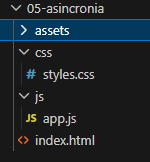
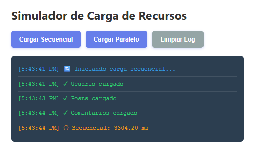
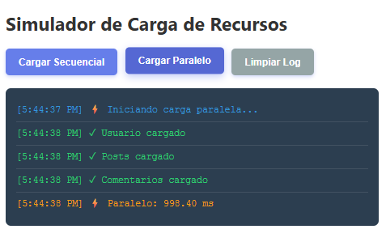
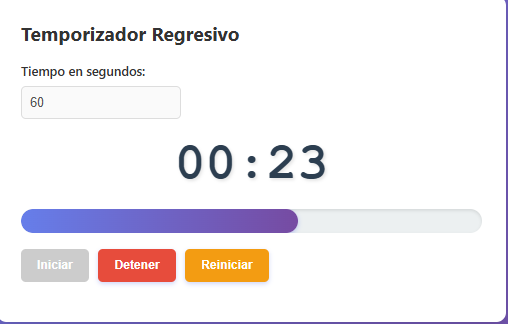
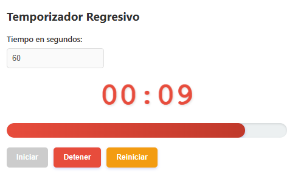
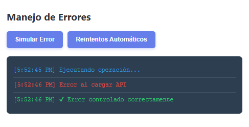
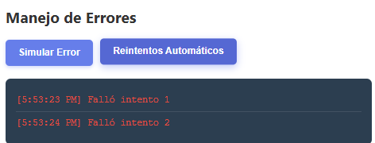
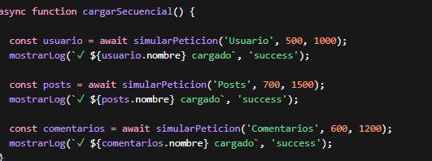

#  PRÁCTICA 05 - ASINCRONÍA EN JAVASCRIPT


---

##  1. Descripción del proyecto

En esta práctica se desarrolló un simulador web utilizando JavaScript para comprender el funcionamiento de la **asincronía** en programación.

El proyecto permite simular:

- Carga de datos de forma secuencial
- Carga de datos de forma paralela
- Uso de promesas con tiempos aleatorios
- Manejo de errores con try/catch
- Reintentos automáticos con backoff exponencial
- Temporizador regresivo con barra de progreso

El objetivo principal es analizar la diferencia de rendimiento entre ejecución secuencial y paralela.

---

##  2. Objetivo de la práctica

- Comprender el uso de `async/await`
- Implementar `Promise.all`
- Manejar errores en procesos asíncronos
- Simular peticiones a una API
- Comparar rendimiento entre métodos de ejecución
- Utilizar `setInterval` y `setTimeout`

---

##  3. Análisis del sistema

En este proyecto se comparan dos formas de ejecución:

### 🔹 Ejecución secuencial
- Las tareas se ejecutan una tras otra
- El tiempo total es la suma de todas las peticiones
- Es más lento pero más fácil de entender

### 🔹 Ejecución paralela
- Todas las tareas se ejecutan al mismo tiempo
- El tiempo total es el de la tarea más lenta
- Es más eficiente

✔ Conclusión: la ejecución paralela mejora el rendimiento del sistema.

---

## 4. Evidencias del proyecto

---

###  4.1 Estructura del proyecto
Aquí se muestra la organización de carpetas del proyecto.



---

###  4.2 Carga secuencial
Se observa cómo las peticiones se ejecutan una tras otra.



---

###  4.3 Carga paralela
Se observa cómo todas las peticiones se ejecutan al mismo tiempo.



---

###  4.4 Comparativa de rendimiento
Se muestra la diferencia de tiempo entre secuencial y paralelo.


---

### 4.5 Temporizador en ejecución
El temporizador muestra el tiempo restante con barra de progreso.



---

### 4.6 Alerta del temporizador
Cuando el tiempo es menor a 10 segundos, se activa una alerta visual.



---

### 4.7 Manejo de errores
Se muestra cómo se capturan errores con try/catch.



---

### 4.8 Reintentos automáticos
El sistema intenta volver a ejecutar una petición si falla.



---

### 4.9 Consola del navegador
Se verifica que no existan errores en la consola.


---

### 4.10 Uso de Async/Await
Se observa la ejecución secuencial con async/await.



---

###  4.11 Uso de Promise.all
Se observa la ejecución paralela con Promise.all.


---


### 🔹 Función que simula una promesa

```js id="codigo1"

function simularPeticion(nombre, min = 500, max = 2000, fallar = false) {
  return new Promise((resolve, reject) => {
    const tiempo = Math.floor(Math.random() * (max - min)) + min;

    setTimeout(() => {
      if (fallar) {
        reject(new Error(`Error al cargar ${nombre}`));
      } else {
        resolve({ nombre, tiempo });
      }
    }, tiempo);
  });
}
🔹 Carga secuencial
const usuario = await simularPeticion('Usuario');
const posts = await simularPeticion('Posts');
const comentarios = await simularPeticion('Comentarios');

✔ Se ejecuta paso a paso.

🔹 Carga paralela
const resultados = await Promise.all([
  simularPeticion('Usuario'),
  simularPeticion('Posts'),
  simularPeticion('Comentarios')
]);

✔ Se ejecuta todo al mismo tiempo.

🔹 Manejo de errores
try {
  await simularPeticion('API', 500, 1000, true);
} catch (error) {
  console.log("Error:", error.message);
}

✔ Evita que el programa se detenga.

🔹 Temporizador
intervaloId = setInterval(() => {
  tiempoRestante--;
  actualizarDisplay();

  if (tiempoRestante <= 0) {
    clearInterval(intervaloId);
  }
}, 1000);
```
###  6. Análisis final

Se concluye que la ejecución secuencial es más lenta porque ejecuta las tareas una por una.

La ejecución paralela es más rápida porque ejecuta todas las tareas al mismo tiempo.

Promise.all mejora el rendimiento del sistema.

Async/await facilita la lectura del código.

El manejo de errores evita fallos en la aplicación.

###  7. Conclusión personal

Esta práctica permitió comprender el funcionamiento de la asincronía en JavaScript.

Se aprendió el uso de promesas, async/await y Promise.all para optimizar procesos.

También se reforzó el uso de temporizadores y manejo de errores en aplicaciones web.

###  8. Autor

###  
### Estudiante: Denisse Paredes
correo:dparedesp5@est.ups.edu.ec


