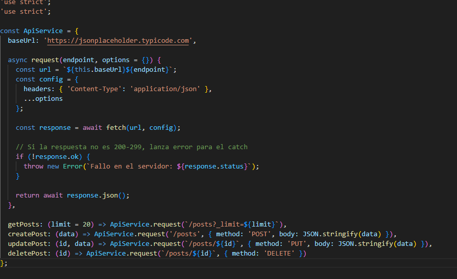
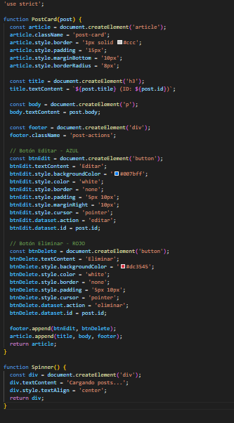
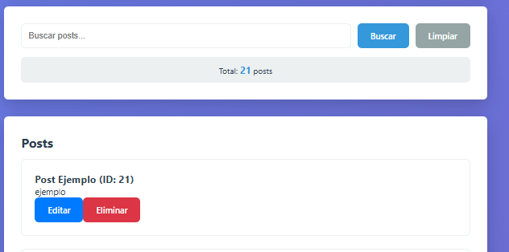
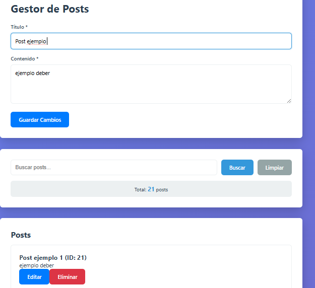
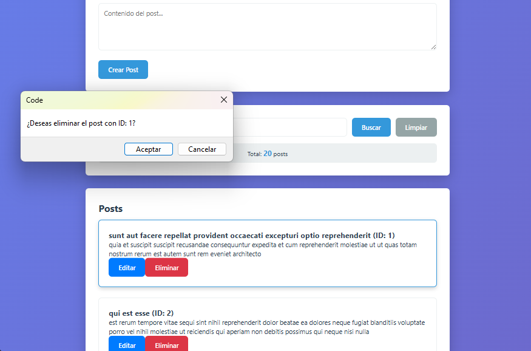
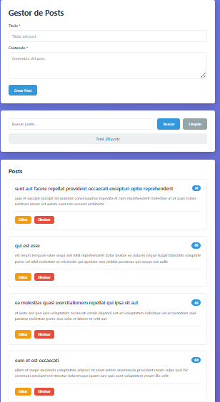
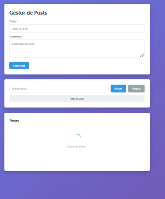
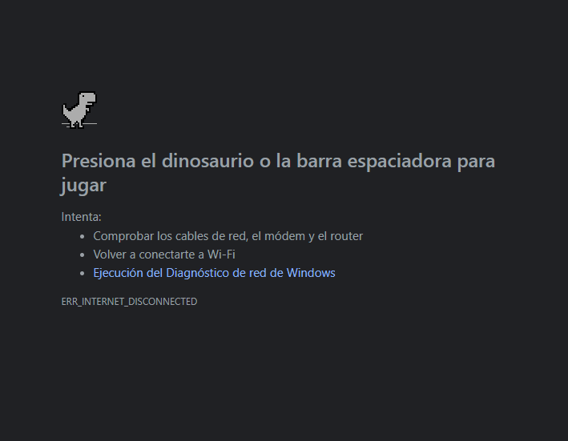

# Práctica 08 - Consumo de API con Fetch y Manipulación del DOM

# Descripción breve de la solución

En esta práctica se desarrolló una aplicación web utilizando **HTML, CSS y JavaScript**, aplicando conceptos de consumo de APIs mediante `fetch()` y manipulación dinámica del DOM.

La aplicación permite consultar datos desde una API externa, mostrarlos en pantalla, crear nuevos registros, editar información, eliminar elementos, visualizar estados de carga y manejar errores de conexión.

También se utilizó la herramienta **DevTools** para analizar las solicitudes realizadas en la pestaña **Network**.

---

# Tecnologías utilizadas

* HTML5  
* CSS3  
* JavaScript Vanilla  
* Fetch API  
* DOM  

---

# Estructura del proyecto

```bash
/practica-08
│── index.html
│── css/
│   └── styles.css
│── js/
│   └── app.js
│── assets/
│   ├── api.png
│   ├── componentes.png
│   ├── Crear.png
│   ├── DevTools Network.png
│   ├── Editar.png
│   ├── Eliminar.png
│   ├── Error.png
│   ├── ListaCargada.png
│   └── spinner.png
│── README.md
```
Funcionalidades implementadas

✔ Consumo de datos desde una API con fetch()
✔ Mostrar información dinámicamente
✔ Crear nuevos elementos
✔ Editar registros existentes
✔ Eliminar elementos
✔ Spinner de carga
✔ Manejo de errores
✔ Visualización de solicitudes en DevTools
✔ Diseño responsive

# Imágenes del proyecto

### 1. Datos obtenidos desde API



**Descripción:** Se muestran correctamente los datos consumidos desde la API.

---

### 2. Componentes renderizados



**Descripción:** Los datos fueron convertidos en tarjetas dinámicas dentro del DOM.

---

### 3. Crear nuevo registro



**Descripción:** Se implementó la opción para agregar nuevos elementos.

---

### 4. Editar registro



**Descripción:** Se modificaron datos existentes correctamente.

---

### 5. Eliminar elemento



**Descripción:** Se eliminó un registro de la lista visual.

---

### 6. Lista cargada



**Descripción:** La lista completa se cargó exitosamente.

---

### 7. Spinner de carga



**Descripción:** Indicador visual mientras se cargan datos desde la API.

---

### 8. Manejo de error



**Descripción:** Se muestra mensaje cuando ocurre un problema al cargar datos.

---

### 9. DevTools - Network


**Descripción:** En la pestaña Network se observan las solicitudes HTTP realizadas con fetch.

Conclusión

En esta práctica reforcé el uso de Fetch API para consumir servicios externos y comprendí cómo manipular el DOM con JavaScript moderno.

También aprendí a manejar errores, mostrar indicadores de carga y analizar solicitudes HTTP desde las herramientas del navegador.

Fue una práctica importante para comprender cómo funcionan aplicaciones web conectadas a APIs reales.

Datos del estudiante

Nombre: Denisse Paredes

Correo: dparedesp5@est.ups.edu.ec