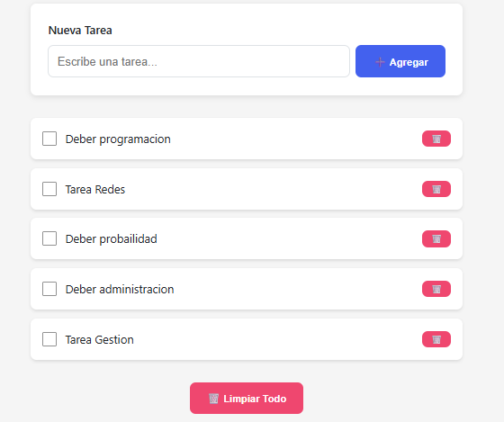
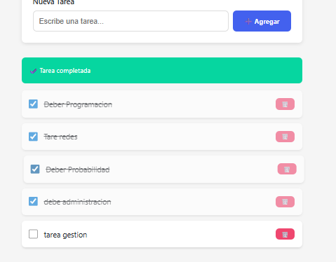
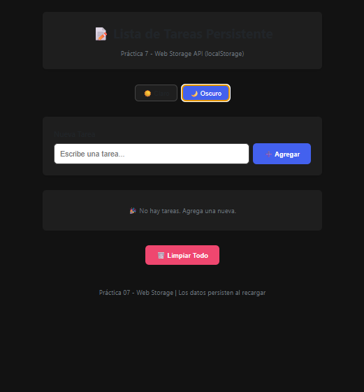

# Práctica 07 - Lista de Tareas Persistente con Web Storage

# Descripción

En esta práctica se desarrolló una aplicación web utilizando **HTML, CSS y JavaScript**, aplicando conceptos de **Web Storage API (localStorage)** y manipulación del DOM.

La aplicación consiste en una lista de tareas donde el usuario puede registrar actividades, marcarlas como completadas, eliminarlas individualmente, limpiar toda la lista y cambiar entre tema claro y oscuro.

Toda la información permanece almacenada en el navegador incluso después de recargar la página.

Se utilizaron funciones JavaScript para:

* Seleccionar elementos del DOM  
* Crear elementos dinámicamente con `createElement()`  
* Insertar texto con `textContent`  
* Guardar datos con `localStorage`  
* Convertir datos con `JSON.stringify()` y `JSON.parse()`  
* Marcar tareas completadas  
* Eliminar elementos  
* Aplicar temas visuales  
* Renderizar datos automáticamente  

---

# Tecnologías utilizadas

* HTML5  
* CSS3  
* JavaScript Vanilla  
* Web Storage API  


# Estructura del proyecto

```bash
/practica-07
│── index.html
│── css/
│   └── styles.css
│── js/
│   ├── storage.js
│   └── app.js
│── assets/
│   ├── Listacondatos.png
│   ├── Persistencia.png
│   ├── TemaOscuro.png
│   └── DevTools Application.png
│── README.md
```


# Imágenes del proyecto

### 1. Lista con tareas creadas




**Descripción:** Se agregaron varias tareas correctamente y se muestran en pantalla.

---

### 2. Persistencia después de recargar



**Descripción:** Después de recargar la página, las tareas continúan almacenadas gracias a localStorage.

---

### 3. Tema oscuro aplicado



**Descripción:** El cambio de tema oscuro se aplicó correctamente y quedó guardado.

---

### 4. DevTools - Local Storage


**Descripción:** En Application > Local Storage se visualizan las claves `tareas_lista` y `tema_app`.

### 5. Lógica principal de la aplicación (app.js)

Este archivo controla toda la interacción de la lista de tareas: 

``` bash
'use strict';

const formTarea = document.getElementById('form-tarea');
const inputTarea = document.getElementById('input-tarea');
const listaTareas = document.getElementById('lista-tareas');
const mensajeEstado = document.getElementById('mensaje-estado');
const btnLimpiar = document.getElementById('btn-limpiar');
const themeBtns = document.querySelectorAll('[data-theme]');

let tareas = [];

function mostrarMensaje(texto, tipo = 'success') {
  mensajeEstado.textContent = texto;
  mensajeEstado.className = `mensaje mensaje--${tipo}`;
  mensajeEstado.classList.remove('oculto');

  setTimeout(() => {
    mensajeEstado.classList.add('oculto');
  }, 2500);
}

function crearElementoTarea(tarea) {
  const li = document.createElement('li');
  li.className = 'task-item';

  if (tarea.completada) {
    li.classList.add('task-item--completed');
  }

  const checkbox = document.createElement('input');
  checkbox.type = 'checkbox';
  checkbox.checked = tarea.completada;

  checkbox.addEventListener('change', () => {
    toggleTarea(tarea.id);
  });

  const texto = document.createElement('span');
  texto.textContent = tarea.texto;

  const btnEliminar = document.createElement('button');
  btnEliminar.textContent = '🗑️';

  btnEliminar.addEventListener('click', () => {
    eliminarTarea(tarea.id);
  });

  li.appendChild(checkbox);
  li.appendChild(texto);
  li.appendChild(btnEliminar);

  return li;
}

function renderizarTareas() {
  listaTareas.innerHTML = '';

  tareas.forEach(tarea => {
    listaTareas.appendChild(
      crearElementoTarea(tarea)
    );
  });
}

function cargarTareas() {
  tareas = TareaStorage.getAll();
  renderizarTareas();
}

function agregarTarea(texto) {
  if (!texto.trim()) return;

  TareaStorage.crear(texto);
  cargarTareas();
}

function toggleTarea(id) {
  TareaStorage.toggleCompletada(id);
  cargarTareas();
}

function eliminarTarea(id) {
  TareaStorage.eliminar(id);
  cargarTareas();
}

function limpiarTodo() {
  TareaStorage.limpiarTodo();
  cargarTareas();
}

function aplicarTema(nombreTema) {
  TemaStorage.setTema(nombreTema);
}

formTarea.addEventListener('submit', e => {
  e.preventDefault();
  agregarTarea(inputTarea.value);
  inputTarea.value = '';
});

btnLimpiar.addEventListener(
  'click',
  limpiarTodo
);

themeBtns.forEach(btn => {
  btn.addEventListener('click', () => {
    aplicarTema(btn.dataset.theme);
  });
});

aplicarTema(TemaStorage.getTema());
cargarTareas();
```

## 6. Servicio de almacenamiento (storage.js)

Este archivo centraliza toda la lógica de **localStorage**, permitiendo guardar tareas y preferencias del tema.

Funciones implementadas:

- Obtener tareas guardadas  
- Crear nuevas tareas  
- Marcar completadas  
- Eliminar tareas  
- Limpiar almacenamiento  
- Guardar tema claro / oscuro  

```javascript
'use strict';

const TareaStorage = {
  CLAVE: 'tareas_lista',

  getAll() {
    try {
      const datos =
        localStorage.getItem(
          this.CLAVE
        );

      return datos
        ? JSON.parse(datos)
        : [];
    } catch (error) {
      return [];
    }
  },

  guardar(tareas) {
    localStorage.setItem(
      this.CLAVE,
      JSON.stringify(tareas)
    );
  },

  crear(texto) {
    const tareas = this.getAll();

    const nueva = {
      id: Date.now(),
      texto: texto.trim(),
      completada: false
    };

    tareas.push(nueva);
    this.guardar(tareas);

    return nueva;
  },

  toggleCompletada(id) {
    const tareas = this.getAll();

    const tarea = tareas.find(
      t => t.id === id
    );

    if (tarea) {
      tarea.completada =
        !tarea.completada;

      this.guardar(tareas);
    }
  },

  eliminar(id) {
    const tareas =
      this.getAll().filter(
        t => t.id !== id
      );

    this.guardar(tareas);
  },

  limpiarTodo() {
    localStorage.removeItem(
      this.CLAVE
    );
  }
};

const TemaStorage = {
  CLAVE: 'tema_app',

  getTema() {
    return localStorage.getItem(
      this.CLAVE
    ) || 'claro';
  },

  setTema(tema) {
    localStorage.setItem(
      this.CLAVE,
      tema
    );
  }
};
```

Funcionalidades implementadas

✔ Agregar tareas

✔ Mostrar tareas almacenadas

✔ Marcar tareas como completadas

✔ Cambiar de completada a pendiente

✔ Eliminar tareas individuales

✔ Limpiar toda la lista

✔ Persistencia al recargar página

✔ Cambio de tema claro / oscuro

✔ Uso de createElement()

✔ Uso de localStorage

## Conclusión

En esta práctica reforcé el uso de JavaScript para manipular el DOM y comprendí cómo almacenar información en el navegador usando localStorage.

También aprendí a trabajar con estructuras JSON, eventos y renderizado dinámico de interfaces.

Fue una práctica importante para entender cómo funcionan aplicaciones web modernas con persistencia de datos sin necesidad de bases de datos externas.

## Datos del estudiante

Nombre: Denisse Paredes
Correo: dparedesp5@est.ups.edu.ec