# Práctica 08 - Formulario de Registro con Validación en Tiempo Real

# Descripción

En esta práctica se desarrolló una aplicación web utilizando **HTML, CSS y JavaScript**, enfocada en la validación de formularios en tiempo real y la manipulación del DOM.

La aplicación consiste en un formulario de registro donde el usuario ingresa sus datos personales. Cada campo es validado automáticamente mientras se escribe, proporcionando retroalimentación inmediata.

El sistema muestra:

- Bordes verdes cuando los campos son correctos  
- Bordes rojos cuando existen errores  
- Mensajes de validación dinámicos  
- Indicador de seguridad de contraseña  
- Visualización de los datos ingresados  
- Registro de información en consola  

Esto permite mejorar la experiencia del usuario y evitar errores antes de enviar el formulario.

---

# Tecnologías utilizadas

* HTML5  
* CSS3  
* JavaScript (Vanilla)  

---

# Estructura del proyecto

```bash
/practica-08
│── index.html
│── css/
│   └── styles.css
│── js/
│   ├── validacion.js
│   ├── components.js
│   └── app.js
│── assets/
│   ├── Formulariovacio.png
│   ├── validacionerror.png
│   ├── validacion.png
│   ├── camposvalidos.png
│   ├── mascaratelefono.png
│   ├── niveldebil.png
│   ├── nivelmedio.png
│   ├── nivelfuerte.png
│   ├── contraseñanocoincide.png
│   ├── envioexitoso.png
│   ├── consola.png
│   └── components.png
│── README.md
```
### 1. Formulario vacío
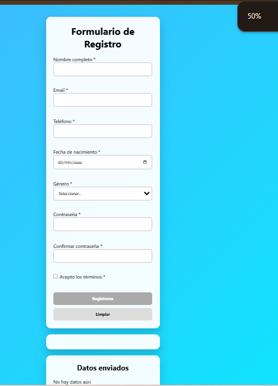

**Descripción:** Se muestra el formulario sin datos ingresados.

---

### 2. Formulario con errores de validación
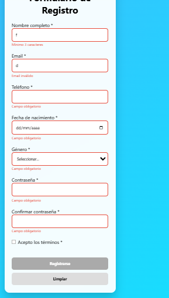

**Descripción:** Los campos inválidos se muestran con bordes rojos y mensajes de error específicos.

---

### 3. Validación correcta
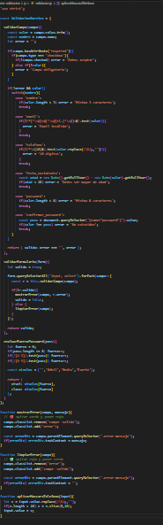

**Descripción:** Los campos válidos se muestran con bordes verdes.

---

### 4. Campos completamente válidos
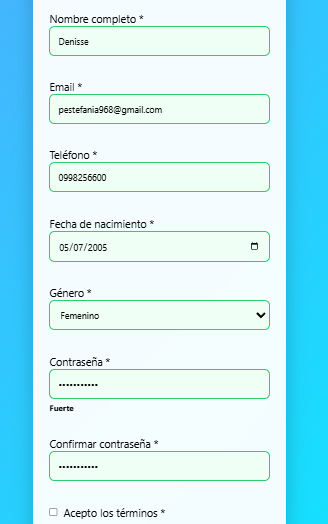

**Descripción:** Todos los campos fueron completados correctamente.

---

### 5. Máscara de teléfono
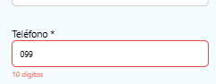

**Descripción:** El campo teléfono solo permite ingresar 10 dígitos.

---

### 6. Indicador de fuerza de contraseña


**Descripción:** Se muestra el nivel de seguridad de la contraseña como "Fuerte".

---

### 7. Niveles de contraseña (débil y media)
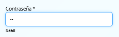
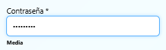

**Descripción:** Se muestran niveles intermedios de seguridad de la contraseña.

---

### 8. Error en confirmación de contraseña
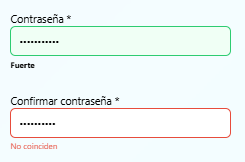

**Descripción:** Se muestra un error cuando las contraseñas no coinciden.

---

### 9. Envío exitoso
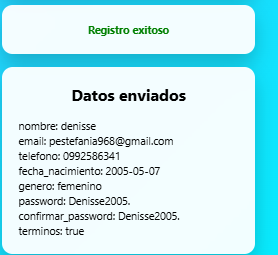

**Descripción:** El formulario se envía correctamente mostrando un mensaje de éxito.

---

### 10. Resultado mostrado
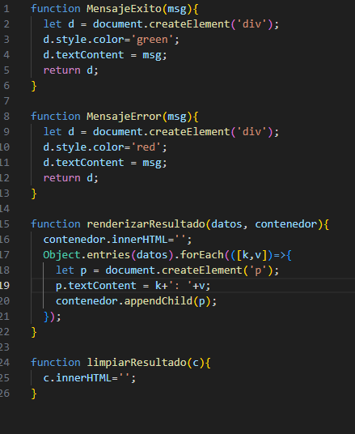

**Descripción:** Se visualizan los datos ingresados por el usuario.

---

### 11. Consola del navegador
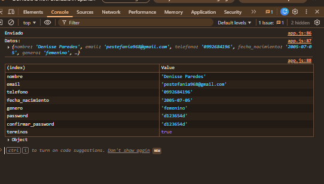

**Descripción:** Se muestran los datos enviados utilizando `console.log` y `console.table`.

### Funcionalidades implementadas

✔ Validación en tiempo real
✔ Validación de campos obligatorios
✔ Validación de email con expresión regular
✔ Validación de teléfono (10 dígitos)
✔ Validación de edad (mayor de 18 años)
✔ Confirmación de contraseña
✔ Indicador de seguridad de contraseña
✔ Mensajes dinámicos de error
✔ Activación automática del botón enviar
✔ Limpieza del formulario
✔ Visualización de resultados
✔ Registro de datos en consola

Lógica principal de la aplicación (app.js)

Este archivo controla la interacción del formulario:
```bash

form.addEventListener('input', e=>{
  if(e.target.matches('input, select')){
    const r = ValidacionService.validarCampo(e.target);

    if(r.valido){
      limpiarError(e.target);
    } else {
      mostrarError(e.target, r.error);
    }
  }
});

form.addEventListener('submit', e=>{
  e.preventDefault();

  if(!ValidacionService.validarFormulario(form)){
    return;
  }

  const datos = Object.fromEntries(new FormData(form));

  console.log('Enviado');
  console.table(datos);
});
Servicio de validación (validacion.js)
```

Este archivo contiene toda la lógica de validación del formulario:

Validación de campos obligatorios
Validación de formatos (email, teléfono)
Comparación de contraseñas
Evaluación de seguridad
Conclusión

En esta práctica se reforzó el uso de JavaScript para validar formularios y manipular el DOM en tiempo real.

Se logró implementar una interfaz interactiva que proporciona retroalimentación inmediata al usuario, mejorando la experiencia de uso.

Además, se aplicaron buenas prácticas de programación y organización del código.

Datos del estudiante

Nombre: Denisse Paredes


Correo: dparedesp5@est.ups.edu.ec